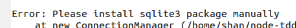

# node TDD sample

## Getting Started

```shell
npm install
npm test
```

##安裝babel-cli

```
npm install -g babel-cli
```

開起檔案
```
babel-node <檔案名稱.js>
```

##problem

如有遇到下圖的問題

可以下npm i npm@3 -g
並將node_modules 刪除重裝

## reference

<http://www.nodebeginner.org/index-zh-tw.html>
